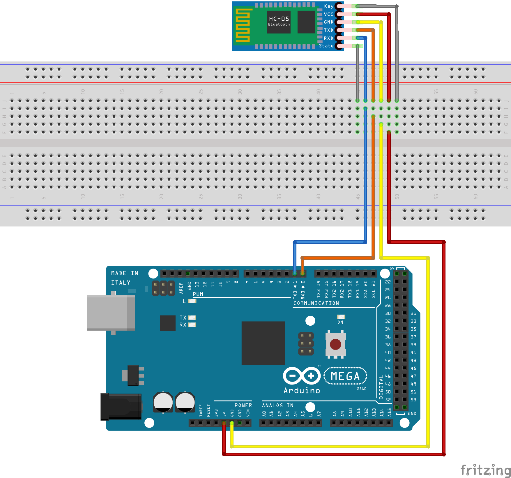

<!-- omit in toc -->
# sample_bluetooth_serial

Bluetoothシリアル通信をFlutterで実験する  
↓ 実際の様子  
[Arduino Mega + HC-05 を Flutterアプリで操作する](https://www.youtube.com/watch?v=yJxWfYq5G0o)

## 1. 構成

### 1.1. Bluetooth機器

Bluetooth機器は Arduino Mega 2560 と HC-05で作成する
ブレッドボード図を以下に示す

Arduino Mega へ書き込むスケッチは[ここ](arduino/led_sample.ino)を参照

### 1.2. Flutterアプリ

#### 1.2.1. 使用パッケージ

- [flutter_bluetooth_serial](https://pub.dev/packages/flutter_bluetooth_serial)
- [flutter_hooks](https://pub.dev/packages/flutter_hooks)

#### 1.2.2. 操作方法

操作方法を下図に示す

## 2. 参考

- [KKHMF HC-05 RS232 モジュール シリアル4ピンポートArduino用](https://www.amazon.co.jp/EasyWordMall-HC-05%E3%83%AF%E3%82%A4%E3%83%A4%E3%83%AC%E3%82%B9-RS232-%E3%83%96%E3%83%AB%E3%83%BC%E3%83%88%E3%82%A5%E3%83%BC%E3%82%B9%E3%83%A2%E3%82%B8%E3%83%A5%E3%83%BC%E3%83%AB-%E3%82%B7%E3%83%AA%E3%82%A2%E3%83%AB4%E3%83%94%E3%83%B3%E3%83%9D%E3%83%BC%E3%83%88Arduino%E7%94%A8/dp/B019E51Y4C)
