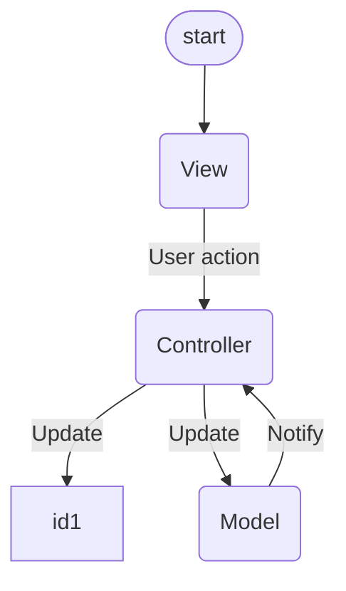

<!-- omit in toc -->
# sample_bluetooth_serial

Bluetoothシリアル通信をFlutterで実験する

## 構成

```mermaid
flowchart
    start([start]) --> id(View) --User action--> id2(Controller) --Update --> id1
    id2(Controller) --Update --> id3(Model) --Notify --> id2
```
